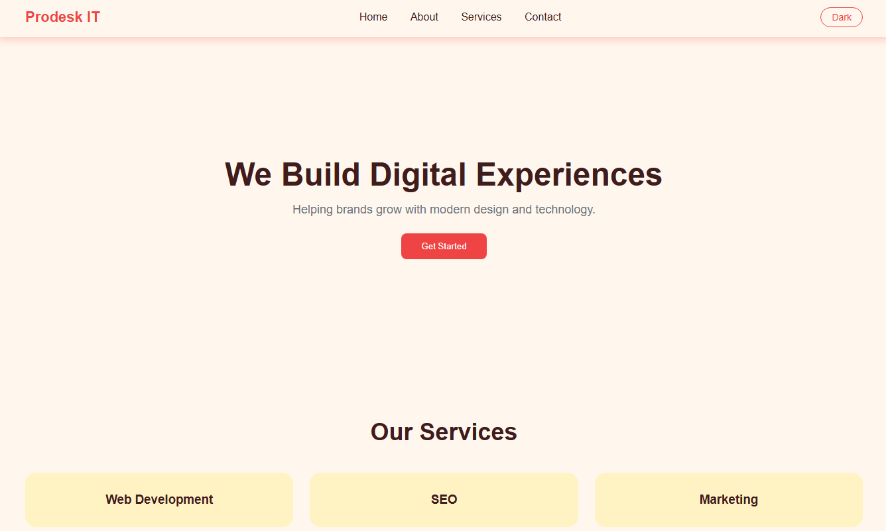
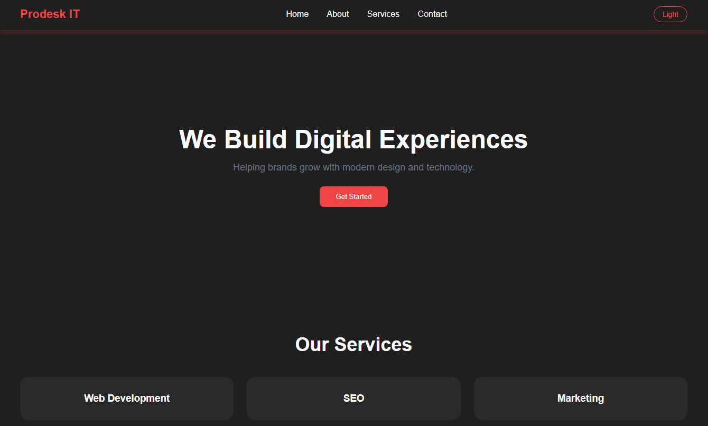

# Prodesk IT – Digital Agency Landing Page

This project is created as part of **Week 1 Internship Assignment (Mission 1: The Corporate Brand)** at **Prodesk IT**.

The goal of this project is to demonstrate strong fundamentals of **HTML, CSS**, **responsive design**, and **basic JavaScript** without using any UI frameworks.

## 🚀 Project Level
**Level 2 – Intermediate**

## ✨ Features
- Fully responsive design (Mobile & Desktop)
- Sticky navigation bar
- Dark mode / Light mode toggle
- Micro-interactions on buttons and service cards
- Clean, modern pastel UI (Cream, Red, Pink & Yellow theme)
- Built using **pure HTML, CSS, and JavaScript**

## 🛠 Tech Stack
- HTML5  
- CSS3  
- JavaScript

## 🌐 Live Demo
Here is my vercel link to view the landing page
**https://landing-page-git-main-riya-guptas-projects-9de56156.vercel.app?_vercel_share=VXjLAgpc3F2OPUWCIn8I5hmAsQKPEuiS**

